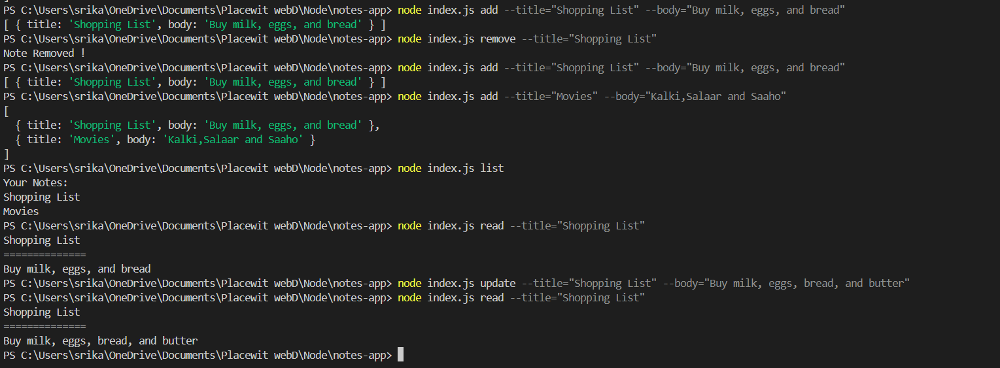

# Notes App

This is a simple command-line application built with Node.js to manage notes. The app allows you to add, remove, list, read, and update notes directly from your terminal.

## Prerequisites

- Node.js installed on your machine.
- Basic knowledge of using the terminal/command line.

## Installation

1. Clone the repository or download the project files.

   ```bash
   git clone https://github.com/Srikar4510/notes-app.git
 
Navigate to the project directory.

```bash
cd notes-app
```
Install the dependencies.

```bash

npm install
```
##Usage

The app supports the following commands:

1. Add a Note

To add a new note, use the add command with a title and body.

```bash
node index.js add --title="Your Note Title" --body="Your Note Body"
```
Example:

```bash

node index.js add --title="Shopping List" --body="Buy milk, eggs, and bread"
```

2. Remove a Note

To remove a note, use the remove command with the title of the note you want to delete.

```bash
node index.js remove --title="Your Note Title"
```

Example:

```bash

node index.js remove --title="Shopping List"
```
3. List All Notes

To list all notes, use the list command. This will display the titles of all stored notes.

```bash
node index.js list
```

4. Read a Note

To read the contents of a specific note, use the read command with the title of the note.

```bash
node index.js read --title="Your Note Title"
```

Example:

```bash
node index.js read --title="Shopping List"
```

5. Update a Note

To update the body of an existing note, use the update command with the title of the note and the new body content.

```bash
node index.js update --title="Your Note Title" --body="Your New Note Body"
```

Example:

```bash
node index.js update --title="Shopping List" --body="Buy milk, eggs, bread, and butter"
```


## Notes Storage
Notes are stored in a notes.json file located in the project directory. This file is automatically created when you add a note.

## command line Version is set to 1.1.0

## License
This project is licensed under the ISC License.